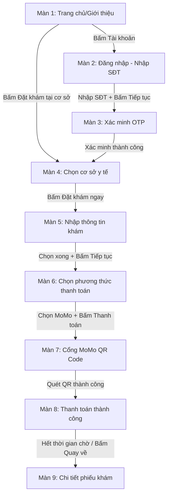

# YÊU CẦU PHÁT TRIỂN GIAO DIỆN (AGENTS REQUIREMENTS)

Tài liệu này mô tả chi tiết yêu cầu thiết kế và các chức năng của từng màn hình trong luồng đặt lịch khám bệnh trực tuyến thuộc dự án **PTTK**. Các AI Agents cần dựa vào đây để triển khai các trang và component tương ứng.

---

## TỔNG QUAN LUỒNG NGƯỜI DÙNG (USER FLOW)

---

## CHI TIẾT CÁC MÀN HÌNH THIẾT KẾ

### MÀN HÌNH 1: TRANG CHỦ / GIỚI THIỆU (`gioi_thieu.png`)
*   **Mô tả:** Trang chủ giới thiệu hệ thống, cung cấp các lối vào đặt khám và tìm kiếm nhanh.
*   **Thành phần Giao diện:**
    1.  **Thanh Header:**
        *   Logo "PTTK" (bên trái).
        *   Nhóm icon mạng xã hội: Tiktok, Zalo, Facebook, Youtube (ở giữa).
        *   Nút hành động: "Tải ứng dụng" (nền xám/trắng) và "Tài khoản" (nền xanh lá, có icon user) (bên phải).
    2.  **Thanh Điều hướng (Navigation Bar):**
        *   Nút nổi bật: "Tư vấn/Đặt khám 1900 2115" (màu xanh lá).
        *   Các liên kết: "Cơ sở y tế", "Dịch vụ y tế", "Khám sức khỏe doanh nghiệp", "Tin tức", "Hướng dẫn", "Liên hệ hợp tác".
    3.  **Khu vực Hero Section:**
        *   Tiêu đề chính: "Kết nối Người Dân với Cơ sở & Dịch vụ Y tế hàng đầu".
        *   Thanh tìm kiếm: Ô nhập liệu tìm bác sĩ, bệnh viện, chuyên khoa kết hợp biểu tượng kính lúp.
        *   Danh sách ưu điểm (checklist):
            *   "Đặt khám nhanh - Lấy số thứ tự trực tuyến - Tư vấn sức khỏe từ xa"
            *   "Đặt khám theo giờ - Đặt càng sớm để có thể có số thứ tự thấp nhất"
            *   "Được hoàn tiền khi hủy khám - Có cơ hội nhận ưu đãi hoàn tiền"
            *   (Mỗi dòng có một icon tích xanh lá ở đầu dòng).
    4.  **Lối vào Dịch vụ (Service Grid):**
        *   Gồm 6 ô dịch vụ dạng Card bo góc tròn, căn giữa, hover có hiệu ứng nổi lên:
            *   *Đặt khám tại cơ sở* (Icon bệnh viện) -> **Lối vào chính dẫn đến Màn 4**.
            *   *Đặt khám ngoài giờ* (Icon đồng hồ).
            *   *Đặt lịch xét nghiệm* (Icon ống nghiệm).
            *   *Gọi video với bác sĩ* (Icon camera/bác sĩ).
            *   *Đặt khám chuyên khoa* (Icon ống nghe).
            *   *Khám doanh nghiệp* (Icon tòa nhà).
*   **Logic Xử lý:**
    *   Bấm vào nút "Đặt khám tại cơ sở" chuyển hướng sang trang Danh sách cơ sở y tế (`datkham.png`).
    *   Bấm vào nút "Tài khoản" mở trang Đăng nhập (`login.png`).

---

### MÀN HÌNH 2: ĐĂNG NHẬP - NHẬP SỐ ĐIỆN THOẠI (`login.png`)
*   **Mô tả:** Bước đầu tiên của quy trình xác thực người dùng bằng số điện thoại.
*   **Thành phần Giao diện:**
    *   Thiết kế chia đôi màn hình (Split screen):
        *   *Bên trái:* Form đăng nhập trên nền trắng.
        *   *Bên phải:* Ảnh nền sảnh bệnh viện/phòng khám lớn hiện đại.
    *   **Form Đăng nhập (bên trái):**
        *   Nút quay lại (Back arrow icon) ở góc trên bên trái.
        *   Logo "PTTK - Đặt khám nhanh".
        *   Tiêu đề: "Nhập số điện thoại để tạo tài khoản và đăng nhập".
        *   Ô nhập số điện thoại: Có chọn mã quốc gia (mặc định hiển thị cờ Việt Nam và mã `+84`). Placeholder gợi ý nhập số điện thoại.
        *   Nút "Tiếp tục": Màu xanh lá, ban đầu bị disable, chỉ active khi nhập đủ và đúng định dạng số điện thoại (9-10 chữ số).
        *   Liên kết trợ giúp: "Gọi hỗ trợ" đi kèm icon điện thoại ở phía dưới.
*   **Logic Xử lý:**
    *   Validate số điện thoại (chỉ nhận số, đúng độ dài số điện thoại Việt Nam).
    *   Bấm "Tiếp tục" chuyển sang Màn 3 (`login_2.png`).

---

### MÀN HÌNH 3: XÁC MINH OTP (`login_2.png`)
*   **Mô tả:** Nhập mã OTP gửi qua SMS để hoàn tất đăng nhập.
*   **Thành phần Giao diện:**
    *   Cấu trúc split-screen giữ nguyên như Màn 2.
    *   **Form nhập OTP (bên trái):**
        *   Ô số điện thoại đã nhập ở bước trước hiển thị dưới dạng chỉ đọc (Disabled/Read-only).
        *   Tiêu đề: "Nhập mã OTP".
        *   Ô nhập mã OTP: Ô nhập 6 chữ số (hoặc ô văn bản thông thường được định dạng).
        *   Đồng hồ đếm ngược: Hiển thị thời gian còn lại để gửi lại mã (ví dụ: `12s` màu xanh lá).
        *   Nút "Tiếp tục": Chỉ active khi nhập đủ mã OTP.
*   **Logic Xử lý:**
    *   Mã OTP giả lập mặc định để test nhanh: `123456`.
    *   Hết thời gian đếm ngược, hiển thị nút/chữ "Gửi lại mã".
    *   Xác thực thành công sẽ chuyển hướng người dùng quay lại luồng đang thực hiện (Danh sách cơ sở y tế).

---

### MÀN HÌNH 4: CHỌN CƠ SỞ Y TẾ (`datkham.png`)
*   **Mô tả:** Danh sách các bệnh viện/phòng khám để người dùng lựa chọn.
*   **Thành phần Giao diện:**
    *   Header giữ nguyên từ trang chủ.
    *   Banner đầu trang: Màu xanh lá với hình minh họa tòa nhà bệnh viện và tiêu đề "ĐẶT KHÁM TẠI CƠ SỞ".
    *   **Thành phần tìm kiếm & lọc:**
        *   Thanh tìm kiếm nhanh cơ sở y tế.
        *   Nhóm tab lọc: "Tất cả" (đang active, viền xanh chữ xanh), "Bệnh viện", "Phòng khám/ Phòng mạch/ Xét nghiệm/ Khác".
    *   **Danh sách cơ sở y tế (Grid 3 cột):**
        *   Mỗi cơ sở là một Card chứa:
            *   Ảnh logo/đại diện cơ sở y tế.
            *   Tên cơ sở (Ví dụ: "Bệnh viện nhân dân 115").
            *   Địa chỉ: "527 Sư Vạn Hạnh, Phường Hòa Hưng, Quận 10...".
            *   Đánh giá: Biểu tượng 5 sao màu vàng.
            *   Nút hành động: "Xem chi tiết" (nút viền xanh, chữ xanh) và "Đặt khám ngay" (nút nền xanh lá, chữ trắng).
*   **Logic Xử lý:**
    *   Tìm kiếm động theo tên cơ sở y tế khi người dùng gõ phím.
    *   Lọc cơ sở theo tab đã chọn.
    *   Bấm "Đặt khám ngay" chuyển sang Màn 5 (`nhap_thong_tin.png`).

---

### MÀN HÌNH 5: NHẬP THÔNG TIN KHÁM (`nhap_thong_tin.png`)
*   **Mô tả:** Chọn chuyên khoa, dịch vụ, ngày giờ khám cụ thể tại cơ sở y tế đã chọn.
*   **Thành phần Giao diện:**
    *   **Breadcrumbs:** "Trang chủ > Bệnh viện nhân dân 115 > Khám dịch vụ".
    *   **Layout chia 2 cột:**
        *   *Cột trái (Thông tin cơ sở):* Card thu nhỏ hiển thị logo, tên và địa chỉ của "Bệnh viện nhân dân 115".
        *   *Cột phải (Thông tin đặt khám - Form chính):*
            *   **Thanh Stepper tiến trình (4 bước):**
                *   Bước 1: Icon ống nghe (Chọn thông tin khám - Đang active màu xanh lá).
                *   Bước 2: Icon hồ sơ bệnh nhân.
                *   Bước 3: Icon xác nhận thông tin.
                *   Bước 4: Icon ví thanh toán.
            *   **Các trường chọn (Dropdowns):**
                *   "Chuyên khoa": Cho chọn danh sách chuyên khoa (Ví dụ: Nội tổng quát, Tim mạch...).
                *   "Dịch vụ": Loại hình khám (Ví dụ: Khám thường, Khám dịch vụ...).
                *   "Phòng khám": Danh sách phòng khám trống.
            *   **Chọn ngày khám (Date Slider):** Thanh trượt ngang hiển thị các ngày trong tuần (Thứ, Ngày, Tháng) kèm nút "Ngày khác" ở cuối. Ngày được chọn sẽ tô nền xanh lá.
            *   **Chọn giờ khám (Time Grid):** Danh sách các khung giờ trống dạng nút bấm (Ví dụ: `07:30 - 08:30`, `08:30 - 09:30`, `09:30 - 10:30`,...). Giờ được chọn sẽ tô nền xanh lá.
            *   **Nút hành động:** Nút "Tiếp tục" lớn màu xanh lá ở dưới cùng, chỉ active khi đã chọn đầy đủ các trường trên.
*   **Logic Xử lý:**
    *   Các trường Dropdown cần liên kết logic (ví dụ chọn Chuyên khoa xong mới hiển thị Dịch vụ và Phòng khám tương ứng).
    *   Khi bấm "Tiếp tục", chuyển sang bước chọn hồ sơ bệnh nhân (mô phỏng nhập thông tin cá nhân) và sau đó dẫn tới Màn 6 (`thanh_toan.png`).

---

### MÀN HÌNH 6: CHỌN PHƯƠNG THỨC THANH TOÁN (`thanh_toan.png`)
*   **Mô tả:** Người dùng chọn phương thức thanh toán cho hóa đơn khám bệnh.
*   **Thành phần Giao diện:**
    *   Cấu trúc split-screen (Trái: Form thanh toán, Phải: Hình ảnh minh họa thương hiệu).
    *   **Form Thanh toán (bên trái):**
        *   Nút quay lại (Back arrow).
        *   Tiêu đề: "Thanh toán hóa đơn".
        *   Thông tin hóa đơn: Mã hóa đơn (Ví dụ: `#106515`), Số tiền thanh toán.
        *   **Danh sách phương thức thanh toán (Radio group):**
            *   Ví điện tử ZaloPay (Logo ZaloPay + tên).
            *   Cổng thanh toán VNPAY (Logo VNPAY + tên).
            *   Ví điện tử MoMo (Logo MoMo + tên - Đang được chọn trong thiết kế).
        *   Nút hành động: "Thanh toán hóa đơn" màu hồng đậm đặc trưng của MoMo (hoặc màu xanh lá tùy phương thức chọn), có chữ hiển thị số tiền thanh toán hoặc thông tin đi kèm.
*   **Logic Xử lý:**
    *   Thay đổi màu sắc nút "Thanh toán hóa đơn" linh hoạt theo phương thức được chọn (ví dụ: MoMo -> nút màu hồng đậm `#A50064`).
    *   Bấm "Thanh toán hóa đơn" với phương thức MoMo sẽ chuyển tới Màn 7 (`thong_tin_thanh_toan.png`).

---

### MÀN HÌNH 7: CỔNG THANH TOÁN MOMO QR CODE (`thong_tin_thanh_toan.png`)
*   **Mô tả:** Giao diện cổng thanh toán giả lập của MoMo hiển thị mã QR để người dùng quét thanh toán.
*   **Thành phần Giao diện:**
    *   Header mang thương hiệu MoMo (màu hồng đậm, logo MoMo).
    *   **Layout chia 2 cột:**
        *   *Cột trái (Thông tin đơn hàng):*
            *   Tên nhà cung cấp: "Doanh nghiệp cung cấp dịch vụ khám sức khỏe PTTK".
            *   Mã đơn hàng: `140171002454595`.
            *   Số tiền: `399.000đ`.
            *   Đồng hồ đếm ngược giao dịch hết hạn (Thời gian bắt đầu từ `10:00` phút).
        *   *Cột phải (Quét mã thanh toán):*
            *   Hình ảnh mã QR Code lớn ở trung tâm.
            *   Dòng chữ hướng dẫn: "Quét mã QR để thanh toán".
            *   Liên kết: "Xem Hướng dẫn" màu hồng.
*   **Logic Xử lý:**
    *   Đồng hồ đếm ngược đếm lùi từng giây từ 10 phút về 0. Nếu về 0 mà chưa thanh toán, hiển thị thông báo giao dịch hết hạn.
    *   Giả lập quét mã: Thiết lập một timeout tự động (khoảng 5-8 giây) để mô phỏng việc người dùng đã quét mã thành công và tự động chuyển sang Màn 8 (`hoanthanh_thanhtoan.png`).

---

### MÀN HÌNH 8: THANH TOÁN THÀNH CÔNG (`hoanthanh_thanhtoan.png`)
*   **Mô tả:** Màn hình xác nhận giao dịch thanh toán qua MoMo đã thành công.
*   **Thành phần Giao diện:**
    *   Header MoMo đồng bộ với Màn 7.
    *   **Khung thông báo trung tâm:**
        *   Biểu tượng tích xanh lá lớn hình tròn ở giữa.
        *   Tiêu đề: "Thanh toán thành công".
        *   Số tiền thanh toán thành công: `399.000đ`.
        *   Thông báo chuyển hướng: "MoMo sẽ tự động đưa bạn về lại trang của Nhà cung cấp".
        *   Biểu tượng vòng xoay loading (Spinner) nhỏ.
        *   Nút bấm/Liên kết thủ công: "Quay về" màu hồng ở dưới cùng.
*   **Logic Xử lý:**
    *   Tự động đếm ngược 3 giây hoặc click vào "Quay về" sẽ chuyển người dùng tới Màn 9 (`chi_tiet_phieu_kham.png`) của hệ thống PTTK.

---

### MÀN HÌNH 9: CHI TIẾT PHIẾU KHÁM (`chi_tiet_phieu_kham.png`)
*   **Mô tả:** Kết quả cuối cùng của luồng đặt lịch, phiếu khám bệnh điện tử chứa thông tin chi tiết và mã QR để kiểm tra tại quầy bệnh viện.
*   **Thành phần Giao diện:**
    *   Header mang logo "PTTK" trên nền hồng/đỏ nhạt, tiêu đề chính giữa: **"Phiếu thanh toán"**.
    *   **Thẻ thông tin phiếu khám (Card trung tâm):**
        *   Mã phiếu khám lớn: `PK-2026-00142`.
        *   **Danh sách thông tin chi tiết (Key-Value):**
            *   *Họ tên bệnh nhân:* Nguyễn Văn An
            *   *Ngày sinh:* 15/03/1990
            *   *Giới tính:* Nam
            *   *Số điện thoại:* 0912 345 678
            *   *Ngày khám:* 03/07/2026
            *   *Giờ khám:* 09:30
            *   *Bác sĩ:* BS. Trần Thị Mai
            *   *Chuyên khoa:* Nội tổng quát
            *   *Phòng khám:* Phòng 205 - Tầng 2
            *   *Trạng thái:* Chờ khám (Text màu xanh lá hoặc màu cam)
        *   **Mã QR Code xác thực phiếu khám:** Nằm ở góc bên phải hoặc dưới danh sách thông tin, dùng để quét check-in tại bệnh viện.
*   **Logic Xử lý:**
    *   Hiển thị đúng các thông tin người dùng đã chọn ở các bước trước (đồng bộ từ `BookingState`).
    *   Cung cấp nút "Lưu phiếu" hoặc "In phiếu" (nếu cần thiết kế thêm) hoặc nút "Về trang chủ" để kết thúc luồng.
